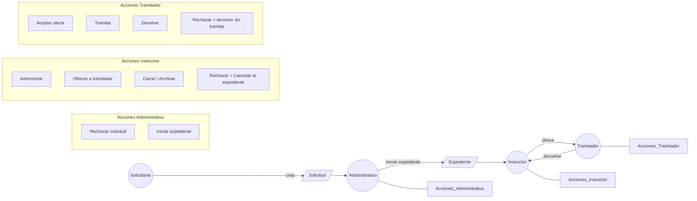
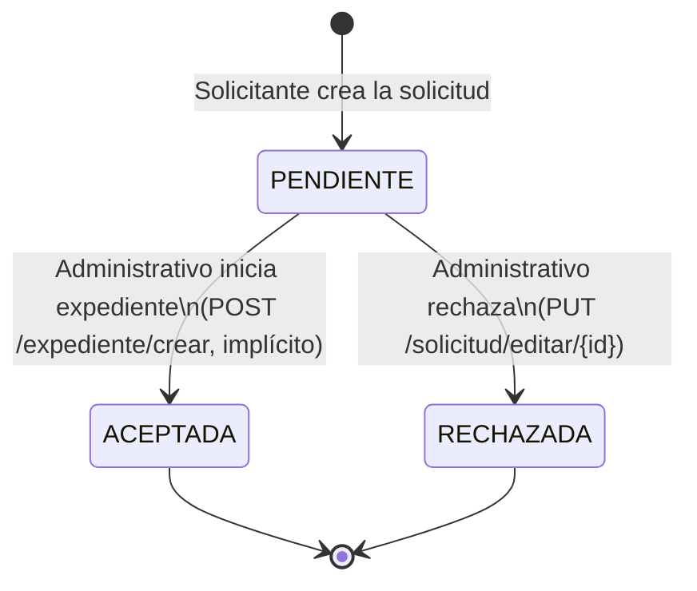
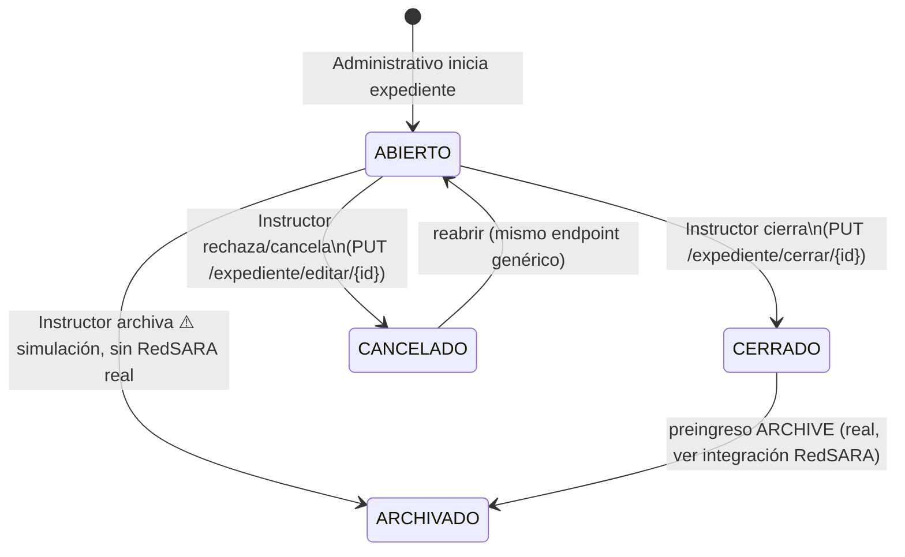
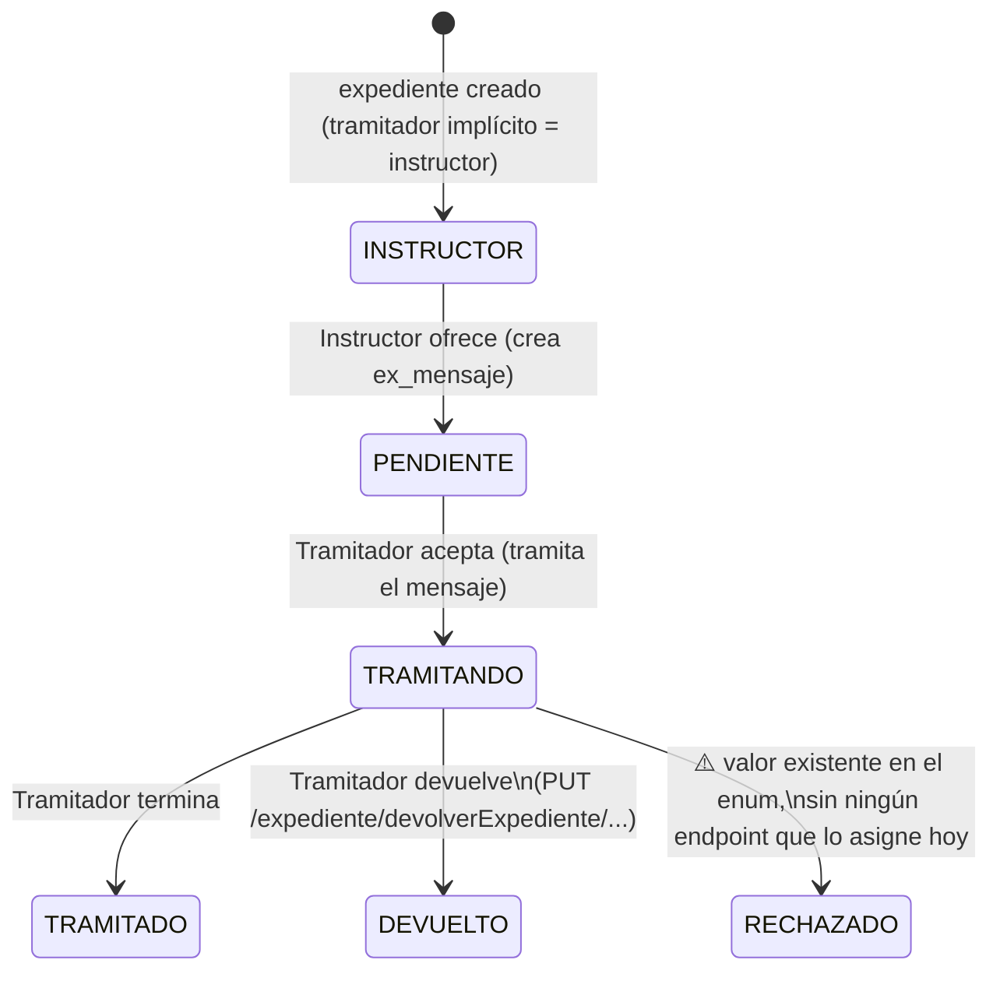

# iFlow — Actores y permisos (diseño, no implementado todavía)

> Este documento define **quiénes son los actores** del flujo Solicitud →
> Expediente → Tramitador y **qué debería poder hacer cada uno**, como paso
> previo a implementar control de acceso real. Hoy (ver §5 y `FLUJOS-REALES.md`)
> **no existe ningún control de acceso**: cualquier usuario autenticado puede
> invocar cualquier endpoint, y el frontend solo oculta botones según el
> *estado* del expediente, no según *quién* es el usuario.
>
> Es un documento vivo: se ajusta contigo antes de tocar código.

## Índice
1. [Actores](#1-actores)
2. [Flujo de objetos y acciones](#2-flujo-de-objetos-y-acciones)
3. [Diagramas de estado](#3-diagramas-de-estado)
4. [Matriz de permisos](#4-matriz-de-permisos)
5. [Huecos identificados (backlog de implementación)](#5-huecos-identificados-backlog-de-implementación)

---

## 1. Actores

| Actor | Es un usuario del sistema (`ge_usuario`) | Cómo se identifica hoy | Dónde vive el dato |
|---|---|---|---|
| **Solicitante** | No — es un ciudadano/entidad externa | Vía `PersonaEntidad` (DNI/CIF, `numDocum`) | `pe_persona_entidad` |
| **Administrativo** | Sí | `ad_organizacion_usuario.solUsuar = '1'` para ese usuario | `ad_organizacion_usuario` (expuesto en frontend como `canManageSolicitudes`) |
| **Instructor** | Sí | Es el username guardado en `Expediente.instructor` (texto libre) | `ex_expediente.instructor` |
| **Tramitador** | Sí | Fila activa en `ex_tramitador` para ese expediente (`posesion=1`, estado `TRAMITANDO`/`PENDIENTE`) | `ex_tramitador` |

Notas:
- **Instructor** y **Tramitador** son roles *por expediente concreto*, no
  globales: un mismo usuario puede ser instructor de un expediente y
  tramitador de otro.
- **Administrativo** es un rol *global* (flag de usuario), no depende del
  expediente.
- El **Solicitante** nunca actúa dentro de `gos-service` autenticado como los
  demás — su intervención termina al crear la Solicitud (o al registrarse por
  registro de entrada); todo lo posterior lo hace el Administrativo en su
  nombre.

---

## 2. Flujo de objetos y acciones

**Semántica de "Rechazar" aclarada (no es la misma acción para los dos actores):**
- **Instructor rechaza** → cancela el expediente completo (`EnumEstadoExpediente.CANCELADO`). Es una decisión sobre si el expediente procede o no.
- **Tramitador rechaza** → declina la tramitación que le ofrecieron y el expediente vuelve al Instructor sin haberse tramitado (`EnumEstadoTramitacion.RECHAZADO`, hoy inalcanzable — ver §5). Es una decisión sobre si *él* la tramita, no sobre si el expediente sigue vivo.

**Matiz importante frente al diagrama original:** "ofrecer/aceptar" no es un
solo paso. Según `FLUJOS-REALES.md` §2, "asignar tramitador" es hoy una
**oferta en dos tiempos**: el Instructor crea un `ex_mensaje` (`PENDIENTE`)
dirigido a un usuario candidato; solo cuando ese usuario **tramita el
mensaje** desde su bandeja se crea la fila real en `ex_tramitador`. No hay
asignación directa/forzada por el Instructor.

---

## 3. Diagramas de estado

### 3.1 `EnumEstadoSolicitud`

No existe un paso "Aceptar" independiente: la única forma de llegar a
`ACEPTADA` es iniciar el expediente (`FLUJOS-REALES.md` §5).

### 3.2 `EnumEstadoExpediente`

✅ **Decidido:** "el Instructor rechaza el expediente" = `CANCELADO`. No hace
falta un estado `RECHAZADO` nuevo en `EnumEstadoExpediente` — es la misma
transición que ya existe (`PUT /expediente/editar/{id}` con
`estado: 'CANCELADO'`), solo falta que quede restringida al Instructor (ver
§5, hueco de guard de backend).

### 3.3 `EnumEstadoTramitacion` (entidad `Tramitador`)

---

## 4. Matriz de permisos

| Acción | Actor(es) que deberían poder | Endpoint real hoy | ¿Valida hoy quién lo ejecuta? |
|---|---|---|---|
| Crear solicitud | Solicitante (vía Administrativo/registro de entrada) | `POST /solicitud/crear` | No |
| Rechazar solicitud | Administrativo | `PUT /solicitud/editar/{id}` (genérico) | No |
| Iniciar expediente (acepta la solicitud) | Administrativo | `POST /expediente/crear` | No |
| Cerrar expediente | Instructor | `PUT /expediente/cerrar/{id}` | Solo valida tareas pendientes, no el actor |
| Rechazar/Cancelar expediente | Instructor | `PUT /expediente/editar/{id}` (genérico) | No |
| Reabrir expediente cancelado | **El mismo** Instructor que lo canceló (no cualquier Instructor, ni Administrativo) | `PUT /expediente/editar/{id}` (genérico) | No |
| Archivar expediente | Instructor | `PUT /expediente/editar/{id}` (genérico) | No |
| Ofrecer expediente a un tramitador | Instructor | `POST /mensaje/crear` | No |
| Aceptar oferta (pasa a tramitador real) | Tramitador destino | `PUT /mensaje/tramitar/{idMensaje}` | No |
| Devolver expediente | Tramitador en posesión | `PUT /expediente/devolverExpediente/{idExped}/{idOrgUsuar}/{usuario}` | No (bug real: `IndexOutOfBoundsException` si no hay tramitador, ver `FLUJOS-REALES.md` §3.6) |
| Rechazar tramitación | Tramitador en posesión | **No existe endpoint** — `EnumEstadoTramitacion.RECHAZADO` está definido pero inalcanzable | N/A |

> Nota sobre "reabrir": como el Instructor se define como *el usuario en
> `Expediente.instructor`* (campo que no cambia al cancelar), "que solo el
> mismo instructor pueda reabrir" se cumple de forma natural comparando
> usuario-actual == `Expediente.instructor` en el momento de la petición — no
> hace falta guardar quién ejecutó el cancelado.

---

## 5. Huecos identificados (backlog de implementación)

Nada de esto se implementa en este documento; queda como lista para la
siguiente sesión de código, en orden aproximado de dependencia:

1. **El JWT no lleva rol/identidad verificable más allá del username.**
   `JwtToken` solo firma `subject` (username) — cualquier control de acceso
   por actor necesita, como mínimo, consultar en cada request quién es el
   usuario (ya se puede, vía `extraerUsername`) y cruzarlo contra
   `Expediente.instructor` / `ex_tramitador.usuario` / `solUsuar` — no hace
   falta meter el rol en el token si se resuelve por expediente en cada
   llamada, pero si se opta por eso, hay que decidirlo explícitamente.
2. ~~No hay estado `RECHAZADO` en `EnumEstadoExpediente`~~ — **resuelto**:
   "Instructor rechaza" = `CANCELADO` (ya existe, solo falta restringir quién
   puede disparar esa transición).
3. **No hay endpoint para que un Tramitador rechace** (el estado
   `RECHAZADO` de `EnumEstadoTramitacion` existe pero está muerto).
4. **No hay guard/interceptor backend** que compare "usuario autenticado" vs.
   "actor permitido para esta acción sobre este expediente concreto" — hoy
   `ExpedienteController`/`SolicitudController`/`MensajeController` no tienen
   ninguna anotación ni chequeo de este tipo.
5. **El frontend no sabe qué rol tiene el usuario respecto a un expediente
   concreto** (solo sabe flags globales `solUsuar`/`traUsuar`/`nivAcces`) — para
   ocultar botones correctamente por actor necesitaría, por ejemplo, que el
   backend le diga en la ficha del expediente si el usuario actual es su
   instructor y/o su tramitador activo.
6. Bugs ya documentados en `FLUJOS-REALES.md` que conviene resolver *antes* o
   *junto con* meter permisos, para no construir el control de acceso sobre un
   flujo roto: el `IndexOutOfBoundsException` de `devolverExpediente` (§3.6),
   y el posible contrato roto de `expediente/crear` (path vars vs. body,
   §5 "Discrepancias graves").
