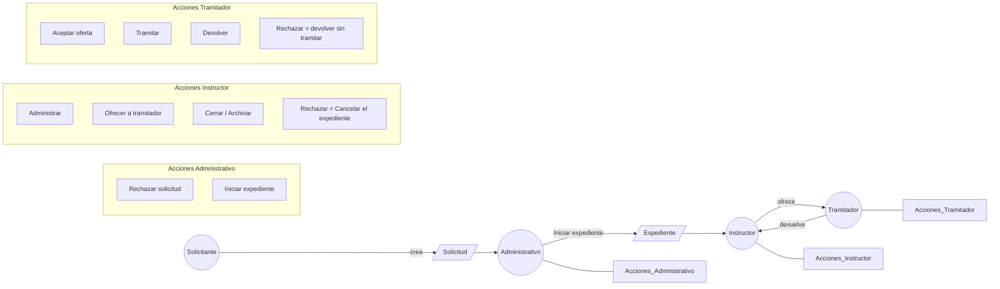
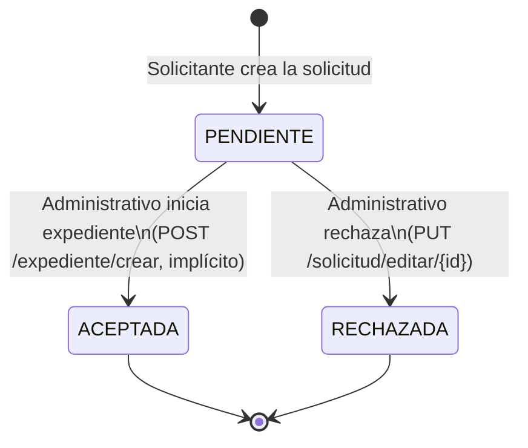
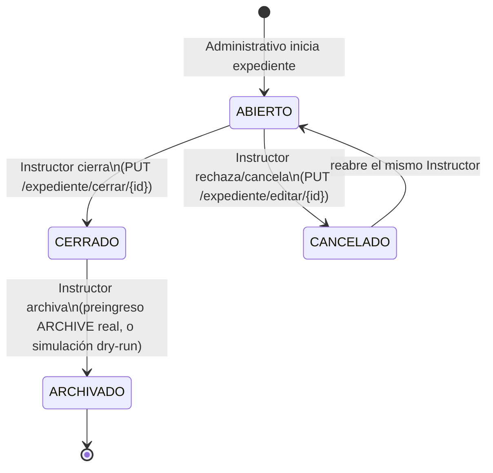
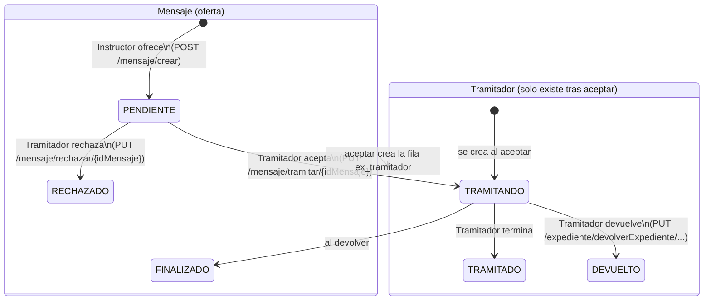

# iFlow — Actores y permisos (diseño, no implementado todavía)

> Este documento define **quiénes son los actores** del flujo Solicitud →
> Expediente → Tramitador y **qué debería poder hacer cada uno**, como paso
> previo a implementar control de acceso real. Hoy (ver §6 y `FLUJOS-REALES.md`)
> **no existe ningún control de acceso**: cualquier usuario autenticado puede
> invocar cualquier endpoint, y el frontend solo oculta botones según el
> *estado* del expediente, no según *quién* es el usuario.
>
> Es un documento vivo: se ajusta contigo antes de tocar código.

## Índice
1. [Actores](#1-actores)
2. [Flujo de objetos y acciones](#2-flujo-de-objetos-y-acciones)
3. [Diagramas de estado](#3-diagramas-de-estado)
4. [Matriz de permisos](#4-matriz-de-permisos)
5. [Mecanismo de enforcement (diseño)](#5-mecanismo-de-enforcement-diseño)
6. [Huecos identificados (backlog de implementación)](#6-huecos-identificados-backlog-de-implementación)

---

## 1. Actores

| Actor | Es un usuario del sistema (`ge_usuario`) | Cómo se identifica hoy | Dónde vive el dato |
|---|---|---|---|
| **Solicitante** | No — es un ciudadano/entidad externa | Vía `PersonaEntidad` (DNI/CIF, `numDocum`) | `pe_persona_entidad` |
| **Administrativo** | Sí | `ad_organizacion_usuario.solUsuar = '1'` para ese usuario | `ad_organizacion_usuario` (expuesto en frontend como `canManageSolicitudes`) |
| **Instructor** | Sí | Es el username guardado en `Expediente.instructor` (texto libre) | `ex_expediente.instructor` |
| **Tramitador** | Sí | Fila activa en `ex_tramitador` para ese expediente (`posesion=1`, estado `TRAMITANDO`/`PENDIENTE`) | `ex_tramitador` |

Notas:
- **Instructor** y **Tramitador** son roles *por expediente concreto*, no
  globales: un mismo usuario puede ser instructor de un expediente y
  tramitador de otro.
- **Administrativo** es un rol *global* (flag de usuario), no depende del
  expediente.
- El **Solicitante** nunca actúa dentro de `gos-service` autenticado como los
  demás — su intervención termina al crear la Solicitud (o al registrarse por
  registro de entrada); todo lo posterior lo hace el Administrativo en su
  nombre.

---

## 2. Flujo de objetos y acciones

**Semántica de "Rechazar" aclarada (no es la misma acción para los dos actores):**
- **Instructor rechaza** → cancela el expediente completo (`EnumEstadoExpediente.CANCELADO`). Es una decisión sobre si el expediente procede o no.
- **Tramitador rechaza** → declina la tramitación que le ofrecieron y el expediente vuelve al Instructor sin haberse tramitado (`EnumEstadoTramitacion.RECHAZADO`, hoy inalcanzable — ver §6). Es una decisión sobre si *él* la tramita, no sobre si el expediente sigue vivo.

**Matiz importante frente al diagrama original:** "ofrecer/aceptar" no es un
solo paso. Según `FLUJOS-REALES.md` §2, "asignar tramitador" es hoy una
**oferta en dos tiempos**: el Instructor crea un `ex_mensaje` (`PENDIENTE`)
dirigido a un usuario candidato; solo cuando ese usuario **tramita el
mensaje** desde su bandeja se crea la fila real en `ex_tramitador`. No hay
asignación directa/forzada por el Instructor.

---

## 3. Diagramas de estado

### 3.1 `EnumEstadoSolicitud`

No existe un paso "Aceptar" independiente: la única forma de llegar a
`ACEPTADA` es iniciar el expediente (`FLUJOS-REALES.md` §5).

### 3.2 `EnumEstadoExpediente`

✅ **Decidido:** "el Instructor rechaza el expediente" = `CANCELADO`. No hace
falta un estado `RECHAZADO` nuevo en `EnumEstadoExpediente` — es la misma
transición que ya existe (`PUT /expediente/editar/{id}` con
`estado: 'CANCELADO'`), solo falta que quede restringida al Instructor (ver
§5, mecanismo de enforcement).

**Guardas adicionales decididas (más allá de "quién" — también "desde qué
estado"):**

| Transición | ¿Permitida? | Nota |
|---|---|---|
| `ABIERTO → ARCHIVADO` (directo, sin pasar por `CERRADO`) | ❌ No | Hoy el endpoint genérico lo permite (bug de guarda ausente, ver `FLUJOS-REALES.md` §3.10) — hay que exigir `estado == CERRADO` antes de archivar |
| `ARCHIVADO → ABIERTO` / `ARCHIVADO → CERRADO` | ❌ No | `ARCHIVADO` es terminal, incluso con el preingreso real a RedSARA (más motivo aún para no revertirlo sin un proceso formal aparte) |
| `CERRADO → CANCELADO` / `ARCHIVADO → CANCELADO` | ❌ No | Cancelar (=rechazar) solo tiene sentido mientras el expediente sigue `ABIERTO`; una vez `CERRADO`/`ARCHIVADO` ya se pasó ese punto de decisión |
| `ABIERTO → CERRADO` mientras el Tramitador está `TRAMITANDO` | ✅ Sí, permitido | El Instructor conserva autoridad final sobre el expediente independientemente de si hay una tramitación activa — cerrar **no** depende del estado de `Tramitador` (ver §3.4) |

### 3.3 `EnumEstadoTramitacion` (entidad `Tramitador`) y `EnumEstadoMensaje` (la oferta)

✅ **Aclarado:** `ex_tramitador` **no existe todavía** mientras la oferta está
`PENDIENTE` — solo se crea al aceptar (`PUT /mensaje/tramitar/{idMensaje}`,
`MensajeController.java:379-404`). "Tramitador rechaza sin tramitar" (§2) es
por tanto una acción sobre el **`Mensaje`** (la oferta), no sobre
`Tramitador` — y **ya existe**: `PUT /mensaje/rechazar/{idMensaje}`
(`MensajeController.java:407-419`, con `descripcionRechazo`/`fecRechazo`).

⚠️ **`EnumEstadoTramitacion.RECHAZADO` queda sin usar, a propósito.** Es un
valor del enum distinto (rechazar *después* de ya estar `TRAMITANDO`, casi
igual a `DEVUELTO`) que decidimos no implementar por ahora — ver §6.

### 3.4 Relación entre el estado del Expediente y el estado de Tramitación

Son **dos máquinas de estado independientes**, no una anidada dentro de la
otra: el estado de `Expediente` (ABIERTO/CERRADO/CANCELADO/ARCHIVADO) no
depende del estado de `Tramitador` (INSTRUCTOR/PENDIENTE/TRAMITANDO/...), y
viceversa.

- **Decidido:** el Instructor puede `cerrar` el expediente aunque un
  Tramitador lo tenga en posesión y esté `TRAMITANDO` en ese momento. No hace
  falta que el Tramitador termine (`TRAMITADO`) o lo devuelva (`DEVUELTO`)
  antes. El Instructor tiene autoridad final sobre el expediente.
- Consecuencia a tener en cuenta para la implementación (no se decide aquí,
  solo se deja anotado): si el Instructor cierra con un Tramitador todavía
  `TRAMITANDO`, ese `Tramitador` queda "huérfano" — su fila en `ex_tramitador`
  sigue `TRAMITANDO` con `posesion=1` aunque el expediente ya esté `CERRADO`.
  Hay que decidir, cuando se implemente, si `cerrar` debe forzar también el
  cierre de la tramitación activa (p.ej. pasarla a `TRAMITADO` automáticamente)
  o si se deja así y simplemente se ignora en la UI de expedientes cerrados.

---

## 4. Matriz de permisos

| Acción | Actor(es) que deberían poder | Endpoint real hoy | ¿Valida hoy quién lo ejecuta? |
|---|---|---|---|
| Crear solicitud | Solicitante (vía Administrativo/registro de entrada) | `POST /solicitud/crear` | No |
| Rechazar solicitud | Administrativo | `PUT /solicitud/editar/{id}` (genérico) | No |
| Iniciar expediente (acepta la solicitud) | Administrativo | `POST /expediente/crear` | No |
| Cerrar expediente | Instructor | `PUT /expediente/cerrar/{id}` | Solo valida tareas pendientes, no el actor |
| Rechazar/Cancelar expediente | Instructor | `PUT /expediente/editar/{id}` (genérico) | No |
| Reabrir expediente cancelado | **El mismo** Instructor que lo canceló (no cualquier Instructor, ni Administrativo) | `PUT /expediente/editar/{id}` (genérico) | No |
| Archivar expediente | Instructor | `PUT /expediente/editar/{id}` (genérico) | No |
| Ofrecer expediente a un tramitador | Instructor | `POST /mensaje/crear` | No |
| Aceptar oferta (pasa a tramitador real) | Tramitador destino | `PUT /mensaje/tramitar/{idMensaje}` | No |
| Devolver expediente | Tramitador en posesión | `PUT /expediente/devolverExpediente/{idExped}/{idOrgUsuar}/{usuario}` | No (bug real: `IndexOutOfBoundsException` si no hay tramitador, ver `FLUJOS-REALES.md` §3.6) |
| Rechazar oferta de tramitación (antes de aceptar) | Tramitador destinatario de la oferta | `PUT /mensaje/rechazar/{idMensaje}` (ya existe) | No |

> Nota: "Rechazar/Cancelar" y "Archivar" además llevan guardas de **estado de
> origen** (no solo de actor) — ver la tabla de transiciones en §3.2: cancelar
> solo desde `ABIERTO`, archivar solo desde `CERRADO`.

> Nota sobre "reabrir": como el Instructor se define como *el usuario en
> `Expediente.instructor`* (campo que no cambia al cancelar), "que solo el
> mismo instructor pueda reabrir" se cumple de forma natural comparando
> usuario-actual == `Expediente.instructor` en el momento de la petición — no
> hace falta guardar quién ejecutó el cancelado.

---

## 5. Mecanismo de enforcement (diseño)

Dos decisiones tomadas, coherentes con el estilo 100% explícito/manual que ya
usa el resto del proyecto (sin AOP, sin Spring Security):

1. **El usuario actual sale siempre del JWT verificado, nunca de lo que manda
   el cliente.** Hoy `JwtAuthenticationFilter.doFilterInternal` calcula
   `JwtToken.extraerUsername(token)` (línea 48) y **lo descarta** — ni se
   guarda ni se usa. Hay que guardarlo (p.ej.
   `request.setAttribute("usuarioAutenticado", username)`) para que los
   controladores lo lean de ahí. Los parámetros `{usuario}`/`usuContr` que hoy
   mandan `devolverExpediente`, `cerrar`, etc. **dejan de ser la fuente de
   verdad para autorizar** — pueden seguir existiendo para otros usos
   (auditoría, texto libre), pero ninguna decisión de permisos se basa en
   ellos.
2. **El chequeo es una llamada explícita a un `PermisosService` nuevo**, como
   primera línea de cada método de controlador que lo necesite — no una
   anotación ni un aspecto automático. Métodos previstos (nombres orientativos,
   se ajustan al implementar):
   - `exigirAdministrativo(String usuario)` — para crear solicitudes/expedientes,
     rechazar solicitud.
   - `exigirInstructor(Long idExpediente, String usuario)` — para cerrar,
     cancelar, archivar, ofrecer a tramitador.
   - `exigirMismoInstructorQueCanceló(Long idExpediente, String usuario)` —
     caso específico de reabrir (§4).
   - `exigirTramitadorActivo(Long idExpediente, String usuario)` — para
     tramitar, devolver, rechazar tramitación.
   - Cada uno lanza una excepción nueva `AccionNoPermitidaException` si falla,
     mapeada en `ControllerAdvisor` a `HTTP 403` (mismo patrón que las ~40
     excepciones de negocio que ya existen ahí).

---

## 6. Huecos identificados (backlog de implementación)

Nada de esto se implementa en este documento; queda como lista para la
siguiente sesión de código, en orden aproximado de dependencia:

1. ~~El JWT no lleva rol/identidad verificable más allá del username~~ —
   **resuelto** (§5): no hace falta meter el rol en el token, basta con
   arreglar el filtro para exponer el username ya verificado y resolver el
   actor por expediente en cada request vía `PermisosService`.
2. ~~No hay estado `RECHAZADO` en `EnumEstadoExpediente`~~ — **resuelto**:
   "Instructor rechaza" = `CANCELADO` (ya existe, solo falta restringir quién
   puede disparar esa transición).
3. ~~No hay endpoint para que un Tramitador rechace~~ — **resuelto**: ya
   existe (`PUT /mensaje/rechazar/{idMensaje}`), solo falta agregarle el
   chequeo de permisos (§5) de que el usuario actual sea el destinatario de
   ese mensaje. `EnumEstadoTramitacion.RECHAZADO` se deja sin usar,
   deliberadamente (ver §3.3).
4. ~~No hay guard/interceptor backend~~ — **resuelto** (§5): `PermisosService`
   con llamadas explícitas al inicio de cada método de
   `ExpedienteController`/`SolicitudController`/`MensajeController` que lo
   necesite.
5. **El frontend no sabe qué rol tiene el usuario respecto a un expediente
   concreto** (solo sabe flags globales `solUsuar`/`traUsuar`/`nivAcces`) — para
   ocultar botones correctamente por actor necesitaría, por ejemplo, que el
   backend le diga en la ficha del expediente si el usuario actual es su
   instructor y/o su tramitador activo.
6. Bugs ya documentados en `FLUJOS-REALES.md` que conviene resolver *antes* o
   *junto con* meter permisos, para no construir el control de acceso sobre un
   flujo roto: el `IndexOutOfBoundsException` de `devolverExpediente` (§3.6),
   y el posible contrato roto de `expediente/crear` (path vars vs. body,
   §5 "Discrepancias graves").
7. **Faltan las guardas de estado de origen**, no solo de actor (§3.2): hoy
   `PUT /expediente/editar/{id}` no valida `estado` actual antes de aplicar la
   transición — permite `ABIERTO → ARCHIVADO` directo, `ARCHIVADO → ABIERTO`,
   y cancelar un `CERRADO`, todo lo cual queda ahora explícitamente prohibido
   en el diseño.
8. **Qué pasa con un `Tramitador` "huérfano"** si el Instructor cierra el
   expediente mientras sigue `TRAMITANDO` (§3.4) — decidir si `cerrar` debe
   forzar el cierre de la tramitación activa o dejarla así.
